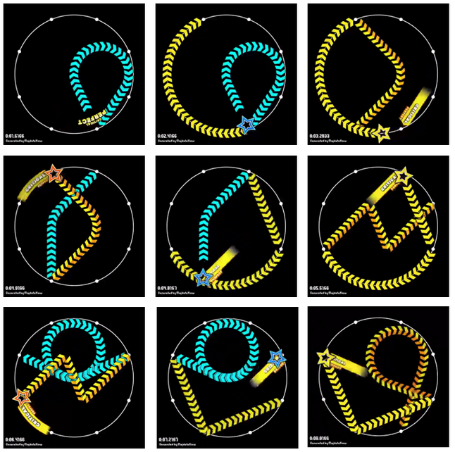

# Problem Statement

maimai is an arcade rhythm game that plays on a circular touch screen surrounded by $8$ evenly spaced buttons. Apart from tap notes and hold notes other rhythm games have, *maimai* has a type of note unique to the game, which are slides. A slide is a path on the touch screen that goes from one button to another (possibly the same) button, and the player must slide on the screen according to the slide’s path and speed to hit the note perfectly.

An interesting programming choice of the game is that slide path shapes are hardcoded, and thus for a fixed time the slide needs to be cleared, it has a fixed speed. There are $M$ types of slides, where the $i$-th type of slide goes from button $X_i$ to button $Y_i$ and has a speed of $V_i$. It is important to note that two different types of slides can start from the same button, end at the same button, and have the same speed, as the two slides may simply have a different path shape which is not given to you for simplicity (formally, it is possible to have $(X_i,Y_i,V_i) = (X_j,Y_j,V_j)$ for $i \ne j$).

In levels of higher difficulties, multiple slides will be chained together such that the player must continuously slide on the screen from a slide to the next. The next slide of the chain must start from the button the previous slide ended, creating this continuous motion. Players collectively coined the term *chain slides* for these kinds of note patterns. Formally, a *chain slide* is a continuous sequence of slides $\{i_1, i_2, \dots\}$ such that $Y_{i_j} = X_{i_{j+1}}$ for all $j$.

As the lead level engineer of the game, Salt wants to create a level that consists of only *chain slides* that **ends at the button the *chain slide* started from**. These *chain slides* do not need to be connected to each other. To make the level consistently engaging, a type of slide must be used at most once (formally, $i_j \ne i_k$ for $j \ne k$). Also, every button should be a starting button of at least one slide (formally, for every button $1 \le B \le 8$, there exists $j$ such that $X_{i_j} = B$).



For the players’ experience, the slide speed should not fluctuate heavily throughout the level, so Salt aims to minimize the range of the slide speed used (formally, Salt wants to minimize $\max(V_{i_j}) - \min(V_{i_j})$).

Salt wants to use at least $K$ slides for her level. Help her find the minimum value of the range of the slide speed, or tell her it is impossible to make such a level!

## Input

The first line of input contains two integers $M$ and $K$ $(1 \le K \le M \le 10^3)$, the number of types of slides and the number of slides Salt wants to use.

The next $M$ lines of input contain three integers $X_i$, $Y_i$, and $V_i$ $(1 \le X_i, Y_i \le 8, 1 \le V_i \le 10^9)$, the start, the end, and the speed of the slide.

## Output

If no such level is possible, output one line containing an integer $-1$.

Otherwise, output one line containing an integer representing the minimum range of speed.


# Sample Input #1
```
12 9
4 4 7
4 8 6
8 5 5
5 1 5
1 6 7
6 2 6
2 7 10
7 3 3
3 4 7
5 5 100
6 3 1
3 4 7
```
# Sample Output #1
```
7
```
# Sample Input #2
```
4 1
1 3 5
4 1 1
1 8 4
1 3 5
```
# Sample Output #2
```
-1
```
# Sample Input #3
```
8 8
1 2 1
2 3 3
3 4 5
4 1 7
5 6 9
6 7 11
7 8 13
8 5 15
```
# Sample Output #3
```
14
```
# Sample Input #4
```
7 7
1 2 1
2 3 3
3 4 5
4 1 7
5 6 9
6 7 11
7 5 13
```
# Sample Output #4
```
-1
```
# Sample Input #5
```
23 8
1 3 94
3 5 94
5 7 95
7 1 95
1 3 97
4 1 98
1 6 102
6 3 102
3 8 102
8 5 102
5 2 106
8 3 106
3 6 110
6 1 110
1 4 110
4 7 110
7 2 114
4 8 114
8 4 118
4 8 118
8 4 118
4 8 118
8 4 12
```
# Sample Output #5
```
-1
```
# Sample Input #6
```
25 8
1 3 94
3 5 94
5 7 95
7 1 95
1 3 97
4 1 98
1 6 102
6 3 102
3 8 102
8 5 102
5 2 106
8 3 106
3 6 110
6 1 110
1 4 110
4 7 110
7 2 114
4 8 114
8 4 118
4 8 118
8 4 118
4 8 118
8 4 122
8 8 1000000000
2 1 112
```
# Sample Output #6
```
17
```