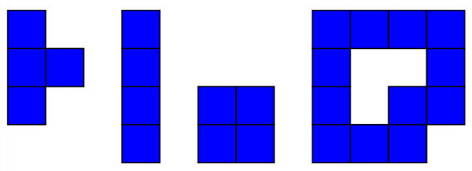
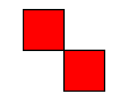
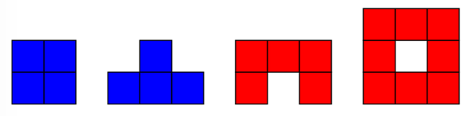
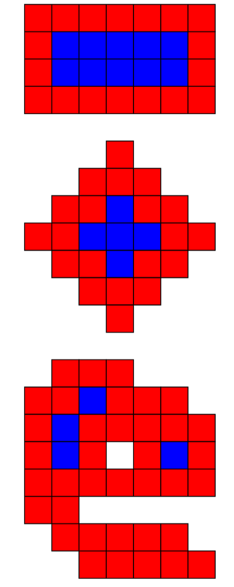

# Problem Statement

A polyomino is a connected shape formed by joining finitely many unit squares (which we call cells) along their sides. From now on, we assume all vertices of the component squares have integer coordinates.



Figure 1: Some polyominos. 



Figure 2: A shape that is not a polyomino because it is not edge-connected. 

A polyomino is called convex when the intersection of any vertical or horizontal lines with it is a connected segment.



Figure 3: More polyominos. Blue ones are convex, red ones are not. 

Within the unit squares that form an polyomino, we say a cell is on the border if not all of its 8 adjacent cells are other squares.



Figure 4: Three polyominos. Red cells are on the border, blue ones are not. 

Consider a convex polyominos $A$. Place $A$ upon an identical copy of itself $A_1$ in such a way that they have some overlap (only rotation by multiples of $90^\circ$ is allowed, and each cell must be overlapped by either a whole cell or nothing i.e. no translation by non-integral offset is allowed).

Find the maximum value of

$$
\frac{\text{number of cells on A’s border and inside } A_1}{\text{number of cells on } A_1\text{’s border and inside } A}.
$$

# Input

There are multiple test cases. The first line is a positive integer, the number of test cases $T$.

For each test: The first line consists of two positive integers $R\ C$, number of rows and columns representing the polyomino.

The remaining $R$ lines each consist of $C$ characters within “`#.`”, where “`#`” is a cell that makes up the polyomino, and “`.`” represents blank space.

It is guaranteed that $T$ is no more than $10^5$, and the sum of $R^3 + C^3$ in a file is no more than $10^7$.

# Output

For each test case, print the result as a reduced fraction $p/q$. It can be shown that the result is neither $0$ nor $\infty$.


# Sample Input #1
```
2
4 6
######
######
######
######
20 20
.........##.........
......########......
....############....
...##############...
..################..
..################..
.##################.
.##################.
.##################.
####################
####################
.##################.
.##################.
.##################.
..################..
..################..
...##############...
....############....
......########......
.........##.........
```
# Sample Output #1
```
2/1
1/1
```