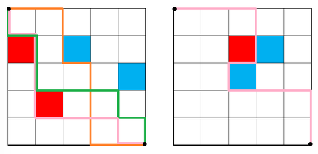

# Problem Statement

**TL;DR:** Let $T = \{(r, c) \mid 1 \le r, c \le N\}$. Count the number of distinct functions  
$f : T \rightarrow \{0, 1, 2\}$ such that $\exists X \subseteq T,\ T \cap f^{-1}(1) = f^{-1}(1),\ T \cap f^{-1}(2) = \emptyset,$  
$(r, c) \in X\ \Longrightarrow\ (r = N \lor (r + 1, c) \in X) \land (c = 1 \lor (r, c - 1) \in X)$.

---

There is a square garden consisting of $N \times N$ tiles in the School of Computing. Each tile is either empty, has a blue flower, or has a red flower. A cat can walk on the border of the garden or between the sides of two adjacent tiles, but not on the tiles themselves.

SoCCat (the cat) is a perfectionist, and considers a path through the garden starting from the top-left corner and ending at the bottom-right corner to be *good* if and only if:

- SoCCat always moves optimally towards the bottom-right corner, i.e., the path only moves right or down.
- Whenever SoCCat looks to the left, all tiles **(from SoCCat’s direct line of sight)** are either empty or have a blue flower, and whenever SoCCat looks to the right, all tiles **(from SoCCat’s direct line of sight)** are either empty or have a red flower. In other words, if we consider the path as splitting the garden into two parts, the top-right part must contain only empty or blue flower tiles, and the bottom-left part must contain only empty or red flower tiles.


For example,  


The orange path and the green path in the garden on the left are examples of a *good* path. On the other hand, the pink path is not a good path, since there is a tile with a red flower when SoCCat looks to the left when traversing the path (in the garden on the left), or SoCCat doesn’t move optimally (in the garden on the right). Note that there are no good paths in the garden on the right.

SoCCat hasn’t seen the garden yet, and so wonders: among the $3^{N \times N}$ possible gardens, how many possible gardens are there such that there exists a good path through the garden? Since the answer can be very large, output the answer modulo $10^9 + 3233$.

# Input

The input contains a single integer $N$ ($2 \le N \le 2500$) denoting the size of the garden.

# Output

Output a single integer denoting the number of possible gardens such that there exists a good path through the garden, modulo $10^9 + 3233$.

# Sample Input #1
```
1
```
# Sample Output #1
```
3
```
# Sample Input #2
```
2
```
# Sample Output #2
```
52
```
# Sample Input #3
```
3
```
# Sample Output #3
```
4032
```
# Sample Input #4
```
4
```
# Sample Output #4
```
1314816
```