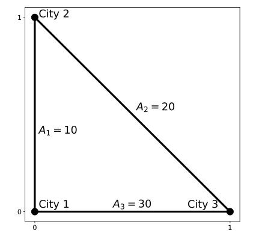

# Problem Statement

There are $n$ cities, numbered from $1$ to $n$, in the fictional country of Manteiv. We can consider these cities to be on a flat plane with a 2D coordinate system, where city $i$ is at coordinates $(x_i, y_i)$. No two cities are located at the same position.

There are $m$ highways, numbered from $1$ to $m$, each of which is a line segment with two different cities as its endpoints and has a number of attraction points alongside it. Specifically, highway $j$ has $a_j$ attraction points and connects cities $u_j$ and $v_j$ as its endpoints. Having intersections on highways causes traffic jams, and building a highway on top of another highway costs a lot of money. Therefore, it is guaranteed that

- no two highways intersect at any point other than at a city,
- no highway passes through a city other than its two endpoints, and
- there is at most one highway connecting each pair of cities.

The Manteiv Ministry of Tourism would like to choose a subset of cities as tourist attractions. Intuitively, the ministry would like many pairs of chosen cities to be connected by a highway with many attraction points. Formally, the attraction score of a non-empty subset of cities $S$ is defined as follows:

- For every pair of integers $(a, b)$ where $a < b$, cities $a$ and $b$ are in $S$, and they are connected by a highway, add the number of attraction points on the highway to the score.

- Let $f(S)$ be the number of pairs of integers $(a, b)$ where $a < b$, cities $a$ and $b$ are in $S$, and they are not connected by a highway. The score incurs a penalty (negative) score of $10^6$ multiplied by the square of $f(S)$. In other words, subtract $10^6 \times f(S)^2$ from the score.

For example, let $n = 3$, cities 1 and 2 be connected by a highway with 10 attraction points, cities 2 and 3 be connected by a highway with 20 attraction points, and cities 1 and 3 not be connected by a highway.

- The attraction score of the subset of cities $\{1\}$ is 0.
- The attraction score of the subset of cities $\{1, 2\}$ is $10 - 10^6 \times 0^2 = 10$.
- The attraction score of the subset of cities $\{2, 3\}$ is $20 - 10^6 \times 0^2 = 20$.
- The attraction score of the subset of cities $\{1, 2, 3\}$ is $10 + 20 - 10^6 \times 1^2 = -999\,970$.

As an advisor to the ministry, you would like to find the maximum attraction score among all possible non-empty subsets of cities $S$.

# Input

The first line of input contains two integers $n$ and $m$ ($1 \le n \le 100\,000$; $0 \le m \le 300\,000$). Each of the next $n$ lines contains two integers. The $i$-th line contains $x_i$ and $y_i$ ($0 \le x_i, y_i \le 10^9$). Each of the next $m$ lines contains three integers. The $j$-th line contains $u_j$, $v_j$, and $a_j$ ($1 \le u_j < v_j \le n$; $0 \le a_j \le 10^6$). The highways are guaranteed to satisfy the conditions in the problem statement.

# Output

Output an integer representing the maximum attraction score among all possible non-empty subsets of cities S.

# Sample Input #1
```
3 2
0 0
0 1
1 0
1 2 10
2 3 20
```
# Sample Output #1
```
20
```
*Explanation for the sample input/output #1*

This sample is the example given in the problem statement above. The subset of cities {2, 3} gives the highest attraction score of 20.

# Sample Input #2
```
3 3
0 0
0 1
1 0
1 2 10
2 3 20
1 3 30
```
# Sample Output #2
```
60
```
*Explanation for the sample input/output #2*

The cities and highways are illustrated by Figure B.1. By choosing cities 1, 2, and 3 in $S$, the attraction score would be $10 + 20 + 30 - 10^6 \times 0^2 = 60$.

*Figure B.1: Illustration of sample input #2.*
