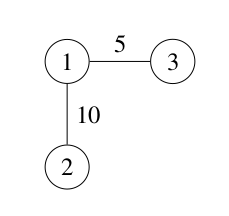
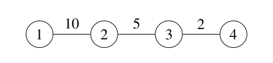

# Problem Statement

There are $n$ cities in Asia-Pacific, numbered from $1$ to $n$. The 2024 ICPC Asia Pacific Championship is held in Hanoi, which is city $n$.

There are $m$ bidirectional roads, numbered from $1$ to $m$, connecting some pairs of cities. Road $i$ connects cities $u_i$ and $v_i$ and takes $t_i$ units of time to travel in either direction. Each road connects different cities and different roads connect different pairs of cities.

You live in city $1$. You would like to travel to city $n$ to attend the contest through a sequence of roads, and then travel back to city $1$ through a sequence of roads. Traveling through the same route is boring, so you would like the routes in both traversals to be different. Two routes are considered different if the **set of distinct** roads traversed through one route is different from the **set of distinct** roads traversed through the other route.

In each traversal, it is possible to pass through the same city or road multiple times. It is also possible to continue traversing after reaching the destination city (i.e., city $1$ or city $n$). The *traversal time* is the sum of the travel times of the roads passed through in the traversal. If a road is passed through multiple times in the traversal, then the travel time of the road is also counted multiple times accordingly.

Determine the minimum total traversal time to do both traversals satisfying the requirements above, or indicate if the requirements cannot be satisfied.

# Input

The first line of input contains two integers $n$ and $m$ ($2 \le n \le 100\,000$; $1 \le m \le \min(\frac{n(n-1)}{2},\,300\,000)$). Each of the next $m$ lines contains three integers. The $i$-th line contains $u_i$, $v_i$, and $t_i$ ($1 \le u_i < v_i \le n$; $1 \le t_i \le 1000$). Different roads connect different pairs of cities.

# Output

Output an integer representing the minimum total traversal time to do both traversals satisfying the requirements above, or $-1$ if the requirements cannot be satisfied.

# Sample Input #1
```
3 2
1 2 10
1 3 5
```
# Sample Output #1
```
30
```
### Explanation for the sample input/output #1

The cities and roads are illustrated by Figure J.1.



One possible way to minimize the total traversal time is as follows:

- Travel from city 1 to city 3 by passing through road 2 (connecting cities 1 and 3). The traversal time is 5. The set of traversed roads is {2}.
- Travel from city 3 to city 1 by passing through road 2, and then road 1 (connecting cities 1 and 2) twice. The traversal time is 5 + 10 + 10 = 25. The set of traversed roads is {1, 2}.

It can be shown that there is no way to do both traversals with a smaller total traversal time.

# Sample Input #2
```
4 3
1 2 10
2 3 5
3 4 2
```
# Sample Output #2
```
-1
```
### Explanation for the sample input/output #2

The cities and roads are illustrated by Figure J.2.



To go from city 1 to city 4 and then back, both traversals have to pass through all the roads. Therefore, it is impossible to satisfy the requirements above.

# Sample Input #3
```
4 4
1 2 3
2 4 2
1 3 3
3 4 4
```
# Sample Output #3
```
12
```
# Sample Input #4
```
3 1
1 2 1000
```
# Sample Output #4
```
-1
```