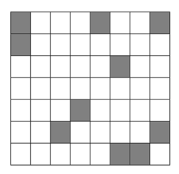
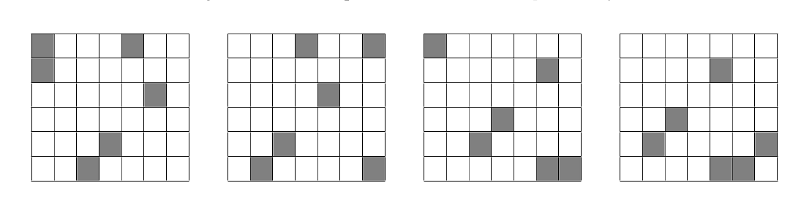

# Problem Statement

*Ever since the Earth got destroyed, Trillian has been missing some Earth delicacies. Today, she had the spaceship’s food machine generate for her a Vietnamese delicacy she once enjoyed:* bánh bò hấp (*steamed chewy sponge cake*).

Trillian has an unlimited number of bánh bò hấp pieces. Each piece of bánh bò hấp is either **red** or **white**. She wants to assemble $rc$ pieces of bánh bò hấp into into a grid with dimensions $r \times c$, where each cell contains a single piece of bánh bò hấp. Thus, there are exactly $2^{rc}$ distinct ways to assemble bánh bò hấp into an $r \times c$ grid, since we consider pieces of the same color to be identical.

We say an assembly of bánh bò hấp is **uniform** if all $6 \times 7$ subgrids have the same number of red pieces. Consequently, in a uniform bánh bò hấp assembly, all $6 \times 7$ subgrids have the same number of white pieces as well. Note that an $r \times c$ grid has $(r - 5)(c - 6)$ subgrids of dimensions $6 \times 7$.

For example, Figure D.1 illustrates a uniform assembly of $7 \times 8$ pieces of bánh bò hấp, where shaded cells represent red bánh bò hấp pieces and unshaded cells represent white bánh bò hấp pieces. Figure D.2 shows that all four $6 \times 7$ subgrids have 6 red pieces and 36 white pieces.



*Figure D.1: An example of uniform* bánh bò hấp *assembly.*



*Figure D.2: All four $6 \times 7$ subgrids of the uniform* bánh bò hấp *assembly illustrated in Figure D.1.*

Given $r$ and $c$, where **$r$ is a multiple of 6** and **$c$ is a multiple of 7**, Trillian would like to calculate the number of possible uniform bánh bò hấp assemblies modulo 998 244 353.

# Input

Input consists of a single line containing two integers $r$ and $c$ ($6 \leq r \leq 66\ 666$; $r$ is a multiple of 6; $7 \leq c \leq 77\ 777$; $c$ is a multiple of 7).

# Output

Output the number of possible uniform *bánh bò hấp* assemblies modulo 998 244 353.

# Sample Input #1
```
6 7
```
# Sample Output #1
```
780136139
```
*Explanation for the sample input/output #1*

The output is $2^{42}$ modulo 998 244 353.

# Sample Input #2
```
12 14
```
# Sample Output #2
```
22889737
```
# Sample Input #3
```
12 42
```
# Sample Output #3
```
96403614
```
# Sample Input #4
```
42 14
```
# Sample Output #4
```
94940316
```