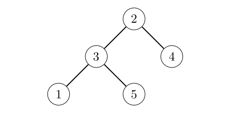

# Problem Statement

Your friend wants to quiz you. You are given a *rooted tree* with $n$ nodes, numbered from $1$ to $n$. For every node $i$, its parent is node $p_i$, except for the *root* (the node without a parent) which has $p_i = 0$. Node $u$ is an *ancestor* of node $v$ if either $u = v$, or node $u$ is an ancestor of the parent of node $v$ (if it exists).

We say that node $z$ is a *common ancestor* of nodes $x$ and $y$ if node $z$ is an ancestor of both nodes $x$ and $y$. We say that node $z$ is the *lowest common ancestor* of nodes $x$ and $y$ if it is a common ancestor of nodes $x$ and $y$, and every common ancestor of nodes $x$ and $y$ is also an ancestor of node $z$. We denote the lowest common ancestor of nodes $x$ and $y$ by $\mathrm{LCA}(x, y)$. In particular, $\mathrm{LCA}(x, x) = x$.

Your friend would like to run the following pseudocode:
```
let L be an empty array
for x = 1 to n
    for y = 1 to n
        append ((x - 1) * n * n + (LCA(x, y) - 1) * n + (y - 1)) to L
    sort L in non-decreasing order
```
Your friend has $q$ questions, numbered from $1$ to $q$. In question $j$, you are given an integer $k_j$ and asked to find the $k_j$-th element of the array $L$. Note that $L$ is 1-indexed, so the indices range from $1$ to $n^2$, inclusive. To pass the quiz, you have to answer all of the questions.

# Input

The first line of input contains two integers $n$ and $q$ ($1 \le n \le 100\,000; 1 \le q \le 100\,000$). The second line contains $n$ integers $p_1, p_2, \ldots, p_n$ ($0 \le p_i \le n$ for all $i$). It is guaranteed that the given values represent a rooted tree. Each of the next $q$ lines contains an integer. The $j$-th line contains the string $k_j$ ($1 \le k_j \le n^2$).

# Output

For each question in order, output an integer representing the answer to the question.

# Sample Input #1
```
5 3
3 0 2 2 3
1
```
# Sample Output #1
```
0
82
124
18
25
```
**Explanation for the sample input/output #1**

The tree in the input is illustrated by Figure K.1.

# Figure K.1: Illustration of the tree in sample input #1.



The elements of *L* are  
(0, 6, 8, 12, 14, 30, 31, 32, 33, 34, 56, 58, 60, 62, 64, 80, 81, 82, 84, 93, 106, 108, 110, 112, 124).
