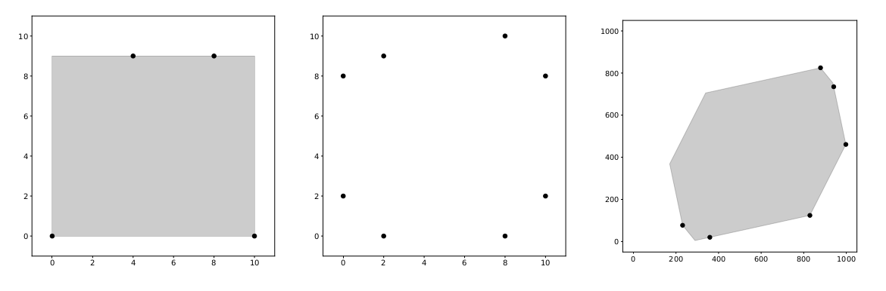

# Problem Statement

Symmetrical figures are beautiful—and they are the subject of this task. A region in a 2D plane is _convex_ if, for every pair of points $p$ and $q$ in the region, the segment connecting $p$ and $q$ is entirely included in the region. Also, a region in a 2D plane is _point-symmetric_ if, when you rotate the region by 180 degrees around a certain point, the rotated region exactly matches the original region.

You are given a convex polygon in a 2D plane with $n$ vertices, numbered from $1$ to $n$ in counterclockwise order. Vertex $i$ has coordinates $(x_i, y_i)$. No three vertices are collinear. Determine whether there exists a convex, point-symmetric region containing all of the $n$ vertices on its boundary. If one or more such regions exist, compute the minimum area among all of them.

# Input

The first line of input contains one integer $n$ ($3 \leq n \leq 30$). Each of the next $n$ lines contains two integers. The $i$-th line contains $x_i$ and $y_i$ ($0 \leq x_i, y_i \leq 1000$).

It is guaranteed that the given polygon is convex, its vertices are given in counterclockwise order, and no three of its vertices are collinear.

# Output

If one or more such regions exist, output the minimum area among all of them. The relative error of the output must be within $10^{-9}$.

If such a region does not exist, output $-1$ instead.

# Sample Input #1
```
4
0 0
10 0
8 9
4 9
```
# Sample Output #1
```
90.0
```
# Sample Input #2
```
8
8 10
2 9
0 8
0 2
2 0
8 0
10 2
10 8
```
# Sample Output #2
```
-1
```
# Sample Input #3
```
6
231 77
359 20
829 124
998 461
941 735
879 825
```
# Sample Output #3
```
486567.9669655848
```
# Explanation for the sample input/output

Figure I.1 illustrates the vertices in the sample input as black dots. For sample inputs #1 and #3, the shaded regions represent the regions with the minimum possible area.

