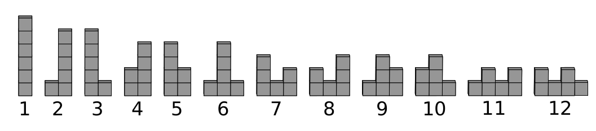

# Problem Statement

Zack’s Zergonomics Zegree has taught him that the optimal way to display items in a store is to stack them into a zig-zag pattern.

Zack needs to display $n$ boxes lined up on the storefront, each one containing an action figure. These boxes can be stacked on top of one another, and they are identical and indistinguishable from each other. His goal is to decide the number of stacks, and then stack up the boxes such that each stack is non-empty, and the numbers of boxes in the stacks form a zig-zag sequence.

Formally, if there are $s$ ($s \ge 1$) stacks numbered $1$ to $s$ from left to right, and stack $i$ contains $a_i$ boxes, then the following conditions must be satisfied:

- $a_i \ge 1$ for each $i$ from $1$ to $s$,
- $a_1 + a_2 + \dots + a_s = n$, and
- at least one of the following is true:
  - $a_1 < a_2 > a_3 < a_4 > \dots$, or
  - $a_1 > a_2 < a_3 > a_4 < \dots$

For example, for $n = 6$, there are 12 ways as illustrated by Figure M.1:



Find the number of different ways Zack can stack $n$ boxes modulo $998\ 244\ 353$.

Two ways are considered the same if and only if the number of stacks is the same, and pairs of stacks at the same positions have the same number of boxes.

# Input

The first line of input contains one integer $t$ ($1 \le t \le 300\ 000$) representing the number of test cases. After that, $t$ test cases follow. Each of them consists of a single line containing one integer $n$ ($1 \le n \le 300\ 000$).

# Output

For each test case, output an integer representing the number of different ways to stack $n$ boxes modulo $998\ 244\ 353$.

# Sample Input #1
```
4
5
6
7
890
```
# Sample Output #1
```
7
12
19
502674609
```
### Explanation for the sample input/output #1

The value of n on the second test case is 6, and the 12 ways are illustrated in the problem description.