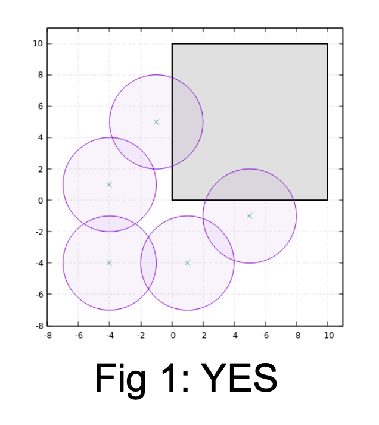
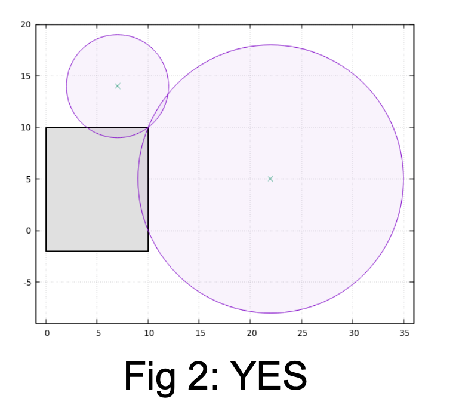
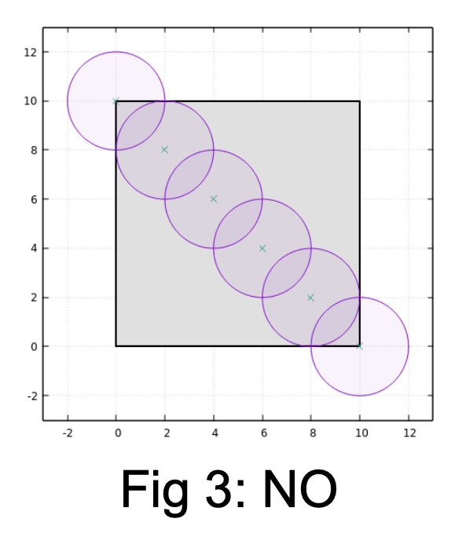
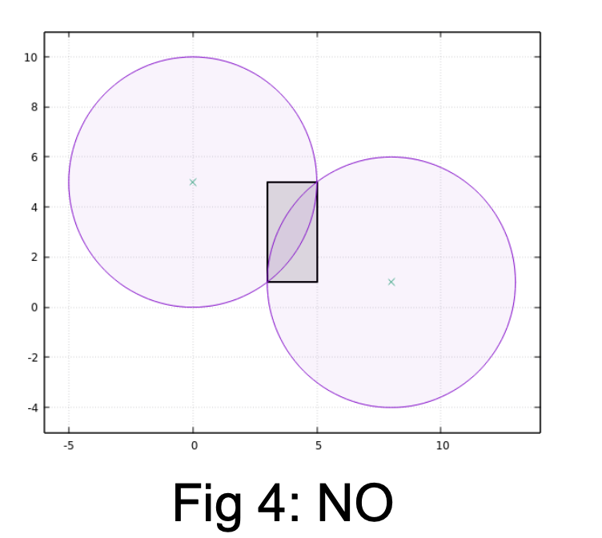
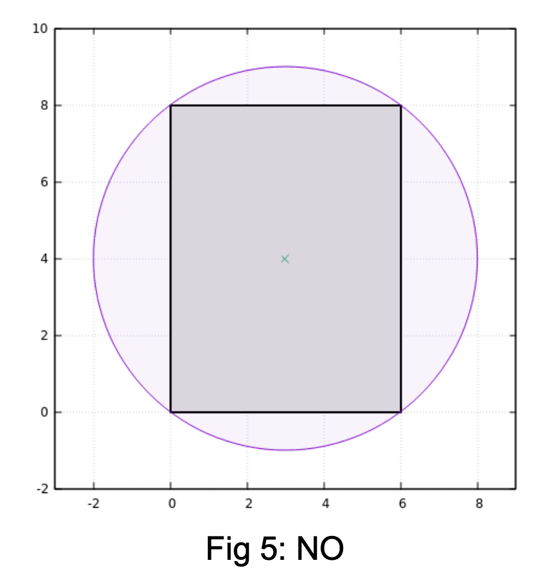
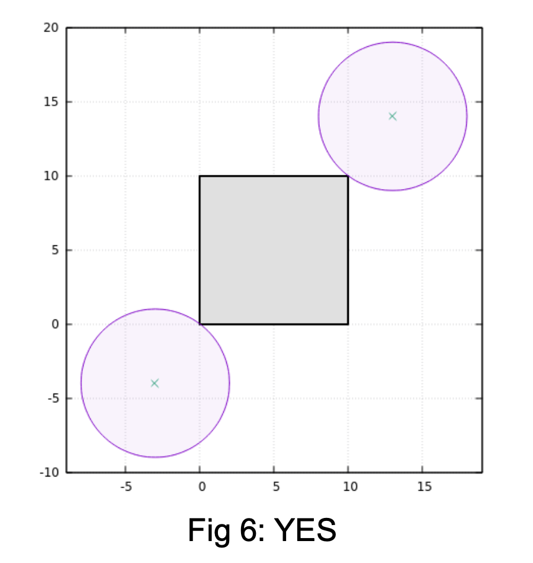
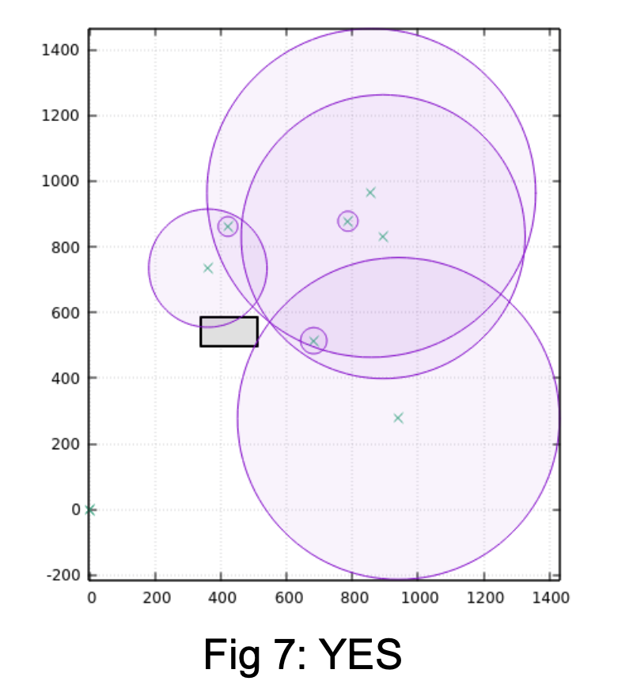

Determining whether there exists a **safe** path (that does not cross with any circle) between the two towers is hard (note that touching the circle is not considered as crossing it). It is easier to determine the opposite:

**A safe path does not exists** when there is a set of **connected** circles that connects the left or top side of the rectangle to the right or bottom side of the rectangle.

However there is a catch, a circle should only be considered **connected** to another circle if:
- One of the intersection points is **strictly** inside the rectangle, or
- Both intersection points are inside (not necessarily strictly inside) the rectangle.

Otherwise, it fails on corner cases like these:

**Fig 1**: shows the catch where naively connecting the circles that go outside the rectangle fails.  

**Fig 2**: one of the circle intersection points is outside the rectangle and the other is touching the tower (not strictly inside the rectangle), thus the two circles are not considered connected.  

**Fig 3**: the intersection points of the top left circle with the next circle are both inside the rectangle boundary (not necessarily strictly inside) and thus they are considered connected.

**Fig 4**: both intersections are inside (i.e., they are touching) the rectangle, thus considered connected.

The implementation to check whether two circles are connected requires computational geometry knowledge to find the actual intersections points between two circles.

One way to determine whether a safe path does not exists is to use disjoint-set (or union-find) algorithm:
1. Initially, there are N + 4 individual components: the N circles and 4 line segments of the rectangles
2. Merge connected-circles into the same component
3. Merge each of the four line segments with the component of a circle if any part of the **line segment is strictly** inside the circle
4. Output "NO" if the left or top line segment of the rectangle is in the same component with the right or bottom of the line segment of the rectangle. Otherwise, output "YES".

Be careful when implementing step 3 of the algorithm (determining whether a line segment intersect with a circle), otherwise, you may fail on cases such as in Fig 5 and Fig 6.

**Fig 5**: NO 

**Fig 6**: YES

Another corner case is when a circle is fully inside another circle as shown in Fig 7. For such case, ignore the inner circle. Otherwise, the inner circles may unwittingly connects circles outside the rectangle.

**Fig 7**: YES
