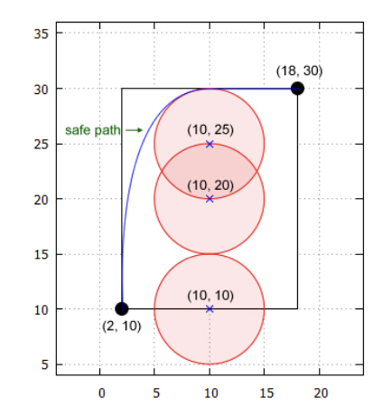

# Problem Statement

Despite its efforts, Indinesia is still regularly hit by uncontrolled forest fires, which causes problems to the local citizens as well as neighbouring countries. Many solutions have been proposed and executed (e.g., dropping water bombs on the burning area), but new hotspots always emerge over time. Nonetheless, Indra, the president of Indinesia, is not yet giving up in solving this problem.

Indinesia has two fire lookout towers located at $(x_1, y_1)$ and $(x_2, y_2)$ where $x_1 < x_2$ and $y_1 < y_2$. Moreover, there are $N$ hotspots scattered across the country. The $i$-th hotspot is a circle with radius $r_i$ and centered at $(f_{x_i}, f_{y_i})$. A point $(x, y)$ is considered **safe** if it satisfies all the following properties:

1. $x_1 \leq x \leq x_2$,
2. $y_1 \leq y \leq y_2$,
3. It must not lie strictly inside any burning area; in other words, for all $1 \leq i \leq N$, the distance of $(x, y)$ to $(f_{x_i}, f_{y_i})$ should be at least $r_i$.

The locations of the two towers are guaranteed to be safe. The two towers can communicate properly if and only if there exists a safe path connecting the two towers. A path is considered as safe if and only if all points on the path are safe. Note that "path" as defined in this problem is any continuous and unnecessarily-straight line.

Your task in this problem is to determine whether the two towers are able to communicate properly.

# Input

The first line of input contains five integers: $x_1$ $y_1$ $x_2$ $y_2$ $N$ ($-1,000,000 \leq x_1 < x_2 \leq 1,000,000$; $-1,000,000 \leq y_1 < y_2 \leq 1,000,000$; $0 \leq N \leq 1000$) in a line denoting the location of the two towers ($(x_1, y_1)$ and $(x_2, y_2)$) and the number of hotspots. The next $N$ lines, each contains three integers: $f_{x_i}$ $f_{y_i}$ $r_i$ ($-1,000,000 \leq f_{x_i}, f_{y_i} \leq 1,000,000$; $1 \leq r_i \leq 2,000,000$) in a line denoting the location of the center of the $i$-th hotspot ($(f_{x_i}, f_{y_i})$) and its radius of burning area. It is guaranteed that there are no two hotspots at the same $(f_{x_i}, f_{y_i})$ location.

# Output

The output contains either `"YES"` or `"NO"` (without quotes) whether the two towers can communicate properly, in a line.

# Sample Input
```
-15 -10 15 10 5
-20 7 9
-2 3 6
8 -3 4
-1 -8 3
-9 -1 3
```
# Output for Sample Input
```
YES
```
# Sample Input
```
2 10 18 30 3
10 20 5
10 29 5
10 11 5
```
# Output for Sample Input
```
NO
```
# Sample Input
```
2 10 18 30 3
10 20 5
10 25 5
10 10 5
```
# Output for Sample Input
```
YES
```
# Explanation for the 1st sample case

For the first sample, the following figure shows one of the safe path connecting the two towers.


# Explanation for the 2nd sample case

For the second sample, there is no possible safe path.


# Explanation for the 3rd sample case

For the third sample, the following figures show two examples of safe paths connecting the two towers.




Notice that the points at (10, 15) in the top figure and (10, 30) in the bottom one are safe.