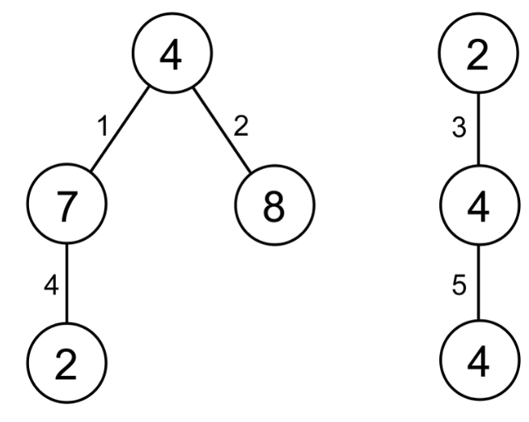
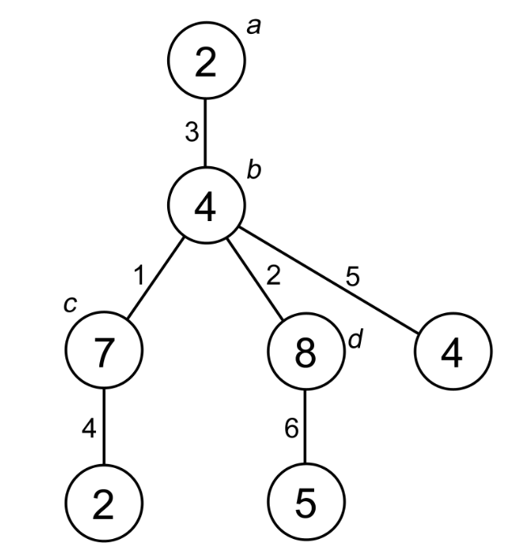

# Problem Statement

In 1736, Leonhard Euler wrote a paper on the Seven Bridges of Königsberg which is regarded as the first paper in the history of graph theory. Nowadays, the study of graph theory is considered very important as indicated by the fact that most textbooks in discrete mathematics have a chapter on graph theory.

This problem is related to graph theory, especially on tree and forest. Given $N$ tuples $(u_i, v_i, w_i)$, your task is to construct a forest with a minimum number of trees which satisfies the following seven requirements:

1. Each tree in the forest is a rooted tree;
2. Each node $x$ in the forest has a value $x.A$;
3. Each edge $(x, y)$ in the forest has a value $(x, y).B$;
4. Each tuple $(u_i, v_i, w_i)$ appears exactly once in the forest as two nodes with a parent-child relationship (parent node $p$ and child node $c$) where: $u_i = p.A$, $v_i = c.A$, and $w_i = (p, c).B$;
5. For any non-root and non-leaf node $x$ in the forest, $(p, x).B$ is smaller than any $(x, c).B$, where $p$ is $x$'s parent and $c$ is $x$'s child;
6. All nodes in the forest have at most $M$ children.
7. The forest should contain exactly $N$ edges.

To simplify the problem, it is guaranteed that $w_i$ in any tuple is unique, i.e. no two tuples with the same $w_i$.

Output the number of trees in such forest (the forest should have the minimum number of trees).

# Input

The first line contains two integers: $N\ M$ ($1 \le N,\ M \le 100{,}000$) in a line denoting the number of tuples and the maximum number of children for each node in the forest. The next $N$ following lines, each contains three integers: $u_i\ v_i\ w_i$ ($1 \le u_i,\ v_i \le 2{,}000{,}000{,}000$; $1 \le w_i \le N$) in a line denoting the tuple $(u_i, v_i, w_i)$. It is guaranteed that there will be no two tuples with the same $w_i$.

# Output

The output contains an integer denoting the number of trees in a forest with a minimum number of trees which satisfies the given requirements, in a line.

# Sample Input
```
5 2
2 4 3
4 4 5
4 7 1
7 2 4
4 8 2
```
# Output for Sample Input
```
2
```
# Sample Input
```
5 1
2 4 3
4 4 5
4 7 1
7 2 4
4 8 2
# Output for Sample Input
3
```
# Sample Input
```
5 10
1000 3000 3
2000 4000 5
1000 2000 1
3000 2000 4
2000 3000 2
```
# Output for Sample Input
```
1
```
Explanation for the 1st sample case



For the first sample, this forest is the only forest which satisfies all the requirements. There are 2 trees in this forest.



On the other hand, this forest does not satisfy the requirements due to:

1. Node **b** violates requirement #5 as $(a,b).B = 3$ is larger than $(b,c).B = 1$ and $(b,d).B = 2$.
2. Node **b** violates requirement #6 as it has 3 children (note that $M = 2$).
3. There are 6 edges in the forest while $N = 5$ (violates requirement #7).

Note that violating even one requirement already makes the forest invalid.
