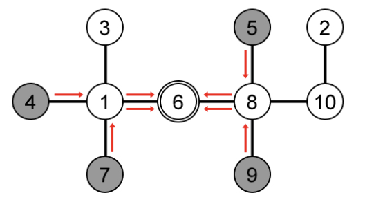

# Problem Statement

ANTS (Agency for Nonsensical Technology Storage) is a leading company specialising in storage for any nonsensical technology. These technologies cannot just be thrown away as it can be hazardous or dangerous, thus they needed to be stored and managed with care.

ANTS owns $N$ warehouses (numbered from $1$ to $N$) which are operated by advanced robots and connected by special rails. One special rail connects exactly two different warehouses and can be used by the robot to move between those two connected warehouses. As the cost to build the special rail at the moment is very expensive, ANTS only built a minimum number of special rails such that it is sufficient for the robots to move between any two warehouses.

Once in a while, the warehouses' manager needs to recalibrate some robots. In order to do this, all the affected robots need to assemble at any one warehouse altogether (the manager decided which warehouse he wants to use as the assembly point). As the cost to build one special rail is very expensive, the manager needs to minimise any unnecessary use of the special rails. In other words, the manager should choose a warehouse as the assembly point for the affected robots such that the number of special rail usage is as minimum as possible.

Consider the following example. Let there be $10$ warehouses with the special rails are arranged in the following way (Figure 1).


Supposed the manager wants to recalibrate four robots which are located at warehouse number 4, 5, 7, and 9. If the manager chooses warehouse number 3 as the assembly point, then the special rails will be used 12 times (Figure 2). In this case, the special rail connecting warehouse 1 and 3 (1-3) in this case is used four times; 1-6 and 6-8 are used twice; 1-4, 1-7, 5-8, and 8-9 are used once. Thus, the total number of special rails usage is $1 \cdot 4 + 2 \cdot 2 + 4 \cdot 1 = 12$.


On the other hand, if the manager chooses warehouse number 6, then the special rails are used only 8 times (Figure 3), and this is the minimum possible for this example. Alternatively, the manager can choose warehouse number 1 or 8 as the assembly point as these choices will cause the special rails to be used 8 times as well.



Given the arrangement of $N$ warehouses and $Q$ queries where each query contains the location of $K$ affected robots which are needed to be recalibrated altogether. For each query, determine the optimum assembly point for the affected robots such that the number of special rail usage is minimised (you only need to output the usage number).

# Input

The first line contains an integer: $N$ $(1 \leq N \leq 100{,}000)$ denoting the number of warehouses. The following $N - 1$ lines, each contains two integers: $a~b$ $(1 \leq a,~b \leq N)$ in a line denoting a special rail connecting warehouse number $a$ and $b$. You may safely assume that all the warehouses are connected to each other, i.e. there is a path from one warehouse to any other warehouse. The next line contains an integer: $Q$ $(1 \leq Q \leq 5000)$ denoting the number of queries. The next $Q$ lines, each begins with an integer $K$ $(1 \leq K \leq 50)$ denoting the number of affected robots, followed by $K$ integers: $A_1~A_2~\cdots~A_K$ $(1 \leq A_i \leq N)$ in a line denoting the query (the warehouse location of the affected $K$ robots).

# Output

For each query, output in a line, the minimum number of special rail usage for that query.

# Sample Input
```
10
1 4
10 2
7 1
6 8
9 8
1 6
8 5
2 8
1 3
5
1 8
2 7 10
3 3 3 4
4 4 7 5 9
5 4 5 9 10
```
# Output for Sample Input
```
0
5
2
8
10
3
```