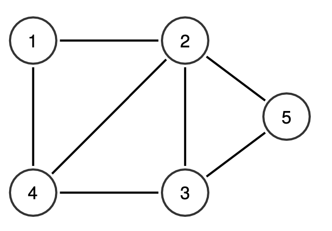

# Problem Statement

Let $G = (V, E)$ be a simple undirected graph with $N$ vertices and $M$ edges, where $V = \{1, \ldots, N\}$. A tuple $\langle u, v, w \rangle$ is called as boomerang in $G$ if and only if $\{(u, v), (v, w)\} \subseteq E$ and $u \ne w$; in other words, a boomerang consists of two edges which share a common vertex.

Given $G$, your task is to find as many disjoint boomerangs as possible in $G$. A set $S$ contains disjoint boomerangs if and only if each edge in $G$ only appears at most once (in one boomerang) in $S$. You may output any valid disjoint boomerangs, but the number of disjoint boomerangs should be maximum.

For example, consider a graph $G = (V, E)$ of $N = 5$ vertices and $M = 7$ edges where $E = \{(1, 2), (1, 4), (2, 3), (2, 4), (2, 5), (3, 4), (3, 5)\}$.



The maximum number of disjoint boomerangs in this example graph is $3$. One example set containing the $3$ disjoint boomerangs is $\{\langle 4, 1, 2 \rangle, \langle 4, 3, 2 \rangle, \langle 2, 5, 3 \rangle\}$; no set can contain more than $3$ disjoint boomerangs in this example.

# Input

Input begins with a line containing two integers: $N\ M$ $(1 \leq N, M \leq 100000)$, representing the number of vertices and the number edges in $G$, respectively. The next $M$ lines, each contains two integers: $u_i\ v_i$ $(1 \leq u_i < v_i \leq N)$, representing the edge $(u_i, v_i)$ in $G$. You may safely assume that each edge appears at most once in the given list.

# Output

The first line of output contains an integer: $K$, representing the maximum number of disjoint boomerangs in $G$. The next $K$ lines, each contains three integers: $u\ v\ w$ (each separated by a single space), representing a boomerang $\langle u, v, w \rangle$. All boomerangs in the output should be disjoint. If there is more than one valid solution, you can output any of them.

# Sample Input #1
```
5 7
1 2
1 4
2 3
2 4
2 5
3 4
3 5
```
# Sample Output #1
```
3
4 1 2
4 3 2
2 5 3
```
# Sample Input #2
```
4 6
1 2
1 3
1 4
2 3
2 4
3 4
```
# Sample Output #2
```
3
1 2 3
1 3 4
1 4 2
```
# Sample Input #3
```
3 3
1 2
1 3
2 3
```
# Sample Output #3
```
1
2 1 3
```