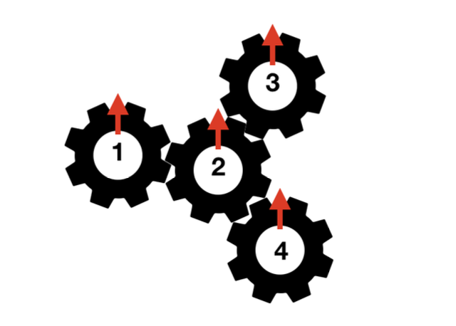

# Problem Statement

Andi has $N$ gears (numbered from $1$ to $N$) on a board. Each gear has an arrow initially pointing upward. Some pair of gears may touch each other. If we construct a graph where each gear is a node, and we connect each pair of touching gears with an edge, then the structure of this graph is a tree. For example, the following is a possible gear configuration example with $N = 4$ gears and gear $2$ touches all other gears.



Standard gear rotation rule applies: Suppose a gear $u$ touches another gear $v$, and gear $u$ is rotated $\alpha$ degrees clockwise, then gear $v$ will be rotated $\alpha$ degrees counter-clockwise, and vice-versa.

Andi wants to perform three kinds of operations:

1. Take out a gear from its position on the board.
2. Place a gear back to its original position on the board. When doing this, Andi places a gear back in a way such that the arrow points to the same degree as when it was removed. Assume that it is always possible to do that, i.e. you do not need to concern with the mechanical aspect of the gear.
3. Rotate a gear $\alpha$ degrees clockwise.

Let $\delta_u$ be the arrow’s degree (clockwise, modulo $360$) of gear $u$ after $Q$ operations are done. Andi wants to know the sum of $\delta_u$ for all $u$. Furthermore, since rotating gears requires a lot of work, Andi also wants to know how much energy he needs for every Type 3 operation (rotating a gear). The amount of energy Andi needs to perform the Type 3 operation is defined as (number of rotating gears) $\times$ (rotation done in degrees)

# Input

Input begins with a line containing an integer $N$ ($1 \leq N \leq 100000$) representing the number of gears. The next $N - 1$ lines, each contains two integers: $u$ $v$ ($1 \leq u,v \leq N; u \ne v$) representing that gear $u$ and gear $v$ touches each other. It is guaranteed that the structure of the connected gears forms a tree. The next line contains an integer $Q$ ($1 \leq Q \leq 100000$) representing the number of operations. The next $Q$ lines, each representing an operation to be done sequentially. Each operation is given in one of the following formats:

- Two integers: `1 x` ($1 \leq x \leq N$). This means that this operation takes out gear $x$ from its position on the board. It is guaranteed that gear $x$ is currently on the board.
- Two integers: `2 x` ($1 \leq x \leq N$). This means that this operation places gear $x$ back to its original position on the board. It is guaranteed that gear $x$ is currently not on the board.
- Three integers: `3 x α` ($1 \leq x \leq N; 0 \leq α \leq 359$). This means that this operation rotates gear $x$ $\alpha$ degrees clockwise. It is guaranteed that gear $x$ is currently on the board.

# Output

For each Type 3 operation in the same order as input, output in a line the amount of energy needed to rotate the gears. Finally, output in a line the sum of $\delta_u$ for all $u$.

# Sample Input
```
4
1 2
2 3
2 4
8
3 2 160
1 2
3 1 10
3 3 10
3 4 10
2 2
1 1
3 3 15
```
# Sample Output
```
640
10
10
10
45
805
```
# Explanation for the sample input/output

The structure of the gears for this sample is illustrated by the figure in the problem description. The following table illustrates the state of each gear after each operation.

| After operation | Gear 1 | Gear 2 | Gear 3 | Gear 4 |
|-----------------|--------|--------|--------|--------|
| Initially       | 0      | 0      | 0      | 0      |
| 1               | **200** | **160** | **200** | **200** |
| 2               | 200    | REMOVED| 200    | 200    |
| 3               | **210** | REMOVED| 200    | 200    |
| 4               | 210    | REMOVED| **210** | 200    |
| 5               | 210    | REMOVED| 210    | **210** |
| 6               | 210    | 160    | 210    | 210    |
| 7               | REMOVED| 160    | 210    | 210    |
| 8               | REMOVED| **145** | **225** | **225** |

Therefore, the sum of $\delta_u$ for all $u$ is $210 + 145 + 225 + 225 = 805$.