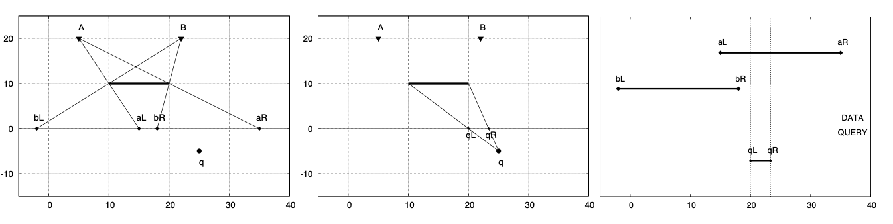

A naïve solution to answer each query $q$ would be simply iterating through each artillery point $p \in P$ and check whether the line connecting $q$ and $p$ intersect with any wall. This solution has a complexity of $O(NM)$ per query, and for this problem, this solution will get you **TIMELIMIT** as the number of artilleries and queries may reach $40000$ each. We need to do better.

First, let’s consider the case when $M = 1$ ($M = 0$ is trivial and not interesting). We can answer each query in $O(\log N)$ time with a preprocess step (for all queries) of $O(N \log N)$. For each point $p$ which lies above the wall, project the wall from point of view $p$ to $y = 0$. Let the projection be $p_L$ and $p_R$. Let $S$ be the collection of all $\langle p_L, p_R \rangle$. Now, to answer a query $q$, do a similar thing, i.e. project the wall from $q$’s point of view to $y = 0$. Let the projection be $q_L$ and $q_R$. The number of artilleries which cannot be seen from $q$ will be equal to the number of tuples $\langle p_L, p_R \rangle$ in $S$ such that $p_L \leq q_L \leq q_R \leq p_R$. You can use any 2-dimensional data structure to answer such query; however, as the data are static (no alteration), a much simpler solution like binary search is better (you also want to avoid a large constant factor in your solution).

Now, to handle $M > 2$, we can use the **inclusion-exclusion principle**. Let $\langle p_L^m, p_R^m \rangle$ be the intersection projection of set of wall $m$ from $p$’s point of view to $y = 0$. In other words, any line from any position $(x, 0)$ where $x = [p_L^m, p_R^m]$ to $p$ will intersect with all $m$. Calculate for all possible set of wall $m$, and the answer to each query then can be computed simply by the inclusion-exclusion principle. The preparation step (one-time) for this approach is $O(2^M N (M + \log(NM)))$, and the query processing is $O(2^M (M + \log(NM)))$ per query.