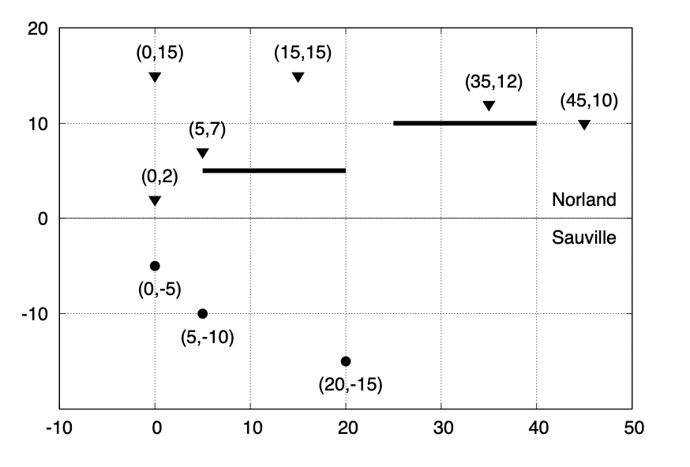

# Problem Statement

Sauville has been engulfed in a devastating war with its neighboring country, Norland, for centuries. Their border can be represented as a straight horizontal line $y = 0$, where all areas for $y < 0$ belong to Sauville and all areas for $y > 0$ belong to Norland.

Norland has deployed $N$ of its artilleries at position $(x_i, y_i)$ where $y_i > 0$. In addition, Norland also has built $M$ defensive walls. Each defensive wall can be represented as a tuple $(x_{j1}, x_{j2}, y_j)$, which is a horizontal line segment spanned from $(x_{j1}, y_j)$ to $(x_{j2}, y_j)$, where $x_{j1} < x_{j2}$ and $y_j > 0$. It is known to Sauville that no Norland’s artillery is located at any of its defensive walls (including its endpoints), and no two artilleries are at the same position. It is also known that no two walls (including their endpoints) are sharing a common point.

Sauville has decided to build a watchtower to observe any suspicious activity on any Norland’s artilleries. As the cost to build one watchtower is almost astronomical for Sauville, they can only afford to build one. Thus, $Q$ position candidates $(x_k, y_k)$ where $y_k < 0$ for the watchtower have been proposed. If the watchtower is built at $(x, y)$, then all artilleries which lie on the _line-of-sight_ from $(x, y)$ can be observed (visible) by the watchtower. A position $(x_i, y_i)$ lies on the line-of-sight from $(x, y)$ if and only if the straight line connecting $(x_i, y_i)$ and $(x, y)$ does not intersect with any defensive walls (including its endpoints); in other words, there should be no point $(x', y')$ such that $(x', y')$ lies on a defensive wall and also on the line segment between $(x_i, y_i)$ and $(x, y)$. Note that an artillery does not affect the visibility of any other artilleries from the watchtower point.

Your task in this problem is to determine the number of Norland’s artilleries which can be observed from each proposed watchtower position.

# Input

Input begins with a line containing three integers: $N$ $M$ $Q$ $(1 \leq N \leq 40000;\ 0 \leq M \leq 5;\ 1 \leq Q \leq 40000)$ representing the number of artilleries, the number of defensive walls, and the number of proposed watchtower positions, respectively. The next $N$ lines, each contains two integers: $x_i$ $y_i$ $(-10^6 \leq x_i \leq 10^6;\ 0 < y_i \leq 10^6)$ representing the position of the $i^{th}$ artillery for $i = 1 \dots N$. The next $M$ lines, each contains three integers: $x_{j1}$ $x_{j2}$ $y_j$ $(-10^6 \leq x_{j1} < x_{j2} \leq 10^6;\ 0 < y_j \leq 10^6)$ representing the position of the $j^{th}$ defensive wall for $j = 1 \dots M$. The next $Q$ lines, each contains two integers: $x_k$ $y_k$ $(-10^6 \leq x_k \leq 10^6;\ -10^6 \leq y_k < 0)$ representing a proposed position for the watchtower.

# Output

For each proposed watchtower position in the same order as input, output in a line a single integer representing the number of Norland’s artilleries which can be observed from the proposed position.

# Sample Input
```
6 2 3
0 2
0 15
5 7
15 15
35 12
45 10
5 20 5
25 40 10
0 -5
5 -10
20 -15
```
# Sample Output
```
4
3
2
```
# Explanation for the sample input/output

The position of all artilleries, defensive walls, and proposed watchtowers are shown in the following figure.



20
(0,15)          (15,15)
(35,12)
(45,10)
10                 (5,7)

(0,2)
Norland
0
Sauville

(0,-5)
-10
(5,-10)

(20,-15)

-10         0          10         20         30         40         50

- The first proposed watchtower (0, −5) can observe 4 artilleries, i.e. at (0, 2), (0, 15), (5, 7), and (45, 10).
- The second proposed watchtower (5, −10) can observe 3 artilleries, i.e. at (0, 2), (0, 15), and (45, 10).
- The third proposed watchtower (20, −15) can observe 2 artilleries, i.e. at (0, 2) and (45, 10).