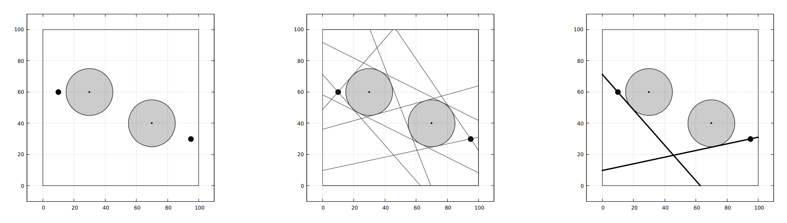

We need a basic understanding of graph theory (pathfinding) and geometry (tangent and line) to solve this problem. The big idea is: The feasible path can be found through some tangent/boundary line segments.

First, let us deal with the geometry aspect of this problem. Find the tangent lines between Allen’s initial/target points to any circles, and the tangent lines between any two circles. Next, make each tangent line into a tangent line segment such that:

1. The two objects (points or circles) which create the tangent line are still connected by the line segment,  
2. The line segment spans as much as possible without crossing any circle or going out of the boundaries.

If the tangent line segment cannot connect the two objects which create it (e.g., it crosses another circle), then we can drop that tangent line. Next, find all the boundary line segments; there are 4 boundaries (the rectangle’s sides), but we need to break them down into some line segments if there is a circle crossing the boundaries.

Now, let us transform this problem into a graph problem. Let the line segments be the vertices, and an edge implies that the two line segments have an intersection point. The starting vertex is all line segments that go through Allen’s initial point, while the goal vertex is all line segments that go through Allen’s target point. Finally, simply do a *breadth-first search* (BFS) to find the path from the starting vertex to the goal vertex. You need to keep the parent node as you do BFS to print the points.
