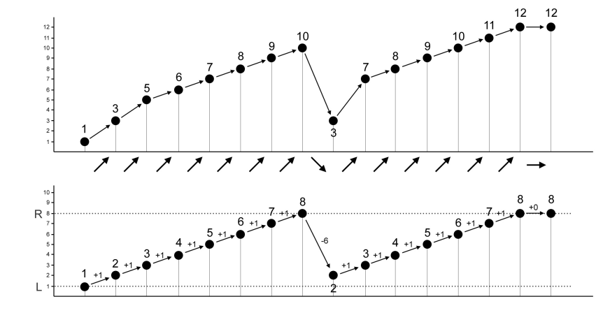

# Problem Statement

Andi is a mathematician, a computer scientist, and a songwriter. After spending so much time writing songs, he finally writes a catchy melody that he thought as his best creation. However, the singer who will sing the song/melody has a unique vocal range, thus, an adjustment may be needed.

A melody is defined as a sequence of $N$ notes which are represented by integers. Let $A$ be the original melody written by Andi. Andi needs to adjust $A$ into a new melody $B$ such that for every $i$ where $1 \leq i < N$:

- If $A_i < A_{i+1}$, then $B_i < B_{i+1}$.
- If $A_i = A_{i+1}$, then $B_i = B_{i+1}$.
- If $A_i > A_{i+1}$, then $B_i > B_{i+1}$.
- $|B_i - B_{i+1}| \leq K$, i.e. the difference between two successive notes is no larger than $K$.

Moreover, the singer also requires that all notes are within her vocal range, i.e. $L \leq B_i \leq R$ for all $1 \leq i \leq N$.

Help Andi to determine whether such $B$ exists, and find the lexicographically smallest $B$ if it exists. A melody $X$ is lexicographically smaller than melody $Y$ if and only if there exists $j$ $(1 \leq j \leq N)$ such that $X_i = Y_i$ for all $i < j$ and $X_j < Y_j$.

For example, consider a melody $A = \{1, 3, 5, 6, 7, 8, 9, 10, 3, 7, 8, 9, 10, 11, 12, 12\}$ as shown in the following figure. The diagonal arrow up in the figure implies that $A_i < A_{i+1}$, the straight right arrow implies that $A_i = A_{i+1}$, and the diagonal arrow down implies that $A_i > A_{i+1}$.



Supposed we want to make a new melody with $L = 1$, $R = 8$, and $K = 6$. The new melody $B = \{1, 2, 3, 4, 5, 6, 7, 8, 2, 3, 4, 5, 6, 7, 8, 8\}$ as shown in the figure satisfies all the requirements, and it is the lexicographically smallest possible.


# Input

Input begins with a line containing four integers: $N\ L\ R\ K$ ($1 \leq N \leq 100\ 000$; $1 \leq L \leq R \leq 10^9$; $1 \leq K \leq 10^9$) representing the number of notes in the melody, the vocal range ($L$ and $R$), and the maximum difference between two successive notes in the new melody, respectively. The next line contains $N$ integers: $A_i$ ($1 \leq A_i \leq 10^9$) representing the original melody.

# Output

Output in a line $N$ integers (each separated by a single space) representing the lexicographically smallest melody satisfying all the requirements, or output -1 if there is no melody satisfying all the requirements. Note that it might be possible that the lexicographically smallest melody which satisfies all the requirements to be the same as the original melody.

# Sample Input #1
```
16 1 8 6
1 3 5 6 7 8 9 10 3 7 8 9 10 11 12 12
```
# Sample Output #1
```
1 2 3 4 5 6 7 8 2 3 4 5 6 7 8 8
```
# Explanation for the sample input/output #1

This is the example from the problem description.

# Sample Input #2
```
16 1 8 6
1 3 5 6 7 8 9 10 3 7 8 9 10 11 12 13
```
# Sample Output #2
```
-1
```
# Sample Input #3
```
16 1 10 10
1 3 5 6 7 8 9 10 3 7 8 9 1 11 12 13
```
# Sample Output #3
```
1 2 3 4 5 6 7 8 1 2 3 4 1 2 3 4
```